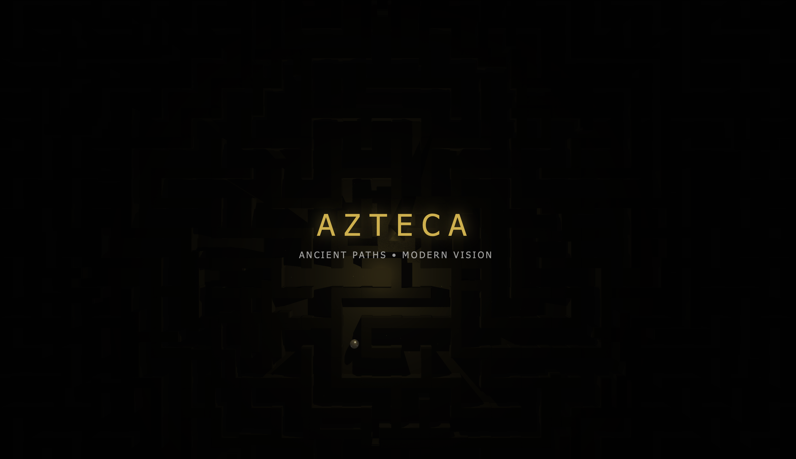

# Aztec Maze - Interactive WebGL Header

An interactive 3D labyrinth header with cursor-driven illumination, built with Three.js. Features a bird's-eye view of a procedurally generated maze with a rolling marble ball that navigates through the paths.



## ✨ Features

- **Procedural Maze Generation** - Complex labyrinth created using recursive backtracking algorithm
- **Interactive Lighting** - Cursor/touch controls a golden light that illuminates the dark maze
- **Rolling Marble Ball** - A marble ball continuously rolls through the maze, turning at walls
- **Responsive Design** - Adapts to all screen sizes (desktop, tablet, mobile)
- **Particle System** - Floating particles that react to cursor proximity
- **Noise Textures** - Procedural textures on maze walls for depth and realism

## 🚀 Live Demo

[View Live Demo](https://cenovastudio.github.io/interactive-maze-web-header-/)

## 🛠️ Technologies

- **Three.js** - 3D WebGL rendering
- **Vanilla JavaScript** - No frameworks required
- **HTML5 Canvas** - Procedural texture generation
- **GLSL Shaders** - Custom particle effects

## 📁 Project Structure

```
aztec-maze/
├── index.html      # Main application (self-contained)
├── README.md       # This file
├── LICENSE         # MIT License
└── preview.png     # Preview image for README
```

## 🎮 How It Works

### Maze Generation
The maze uses a recursive backtracking algorithm to create organic, complex paths. Additional irregular walls (L-shapes, T-junctions, dead-ends) are added for visual complexity.

### Ball Movement
The marble ball follows simple rules:
1. Roll forward until hitting a wall
2. Check left and right for open paths
3. Turn 90° if a side is open, or bounce back 180° at dead ends

### Lighting System
- Main cursor light (golden point light)
- Secondary ambient light
- Four rim lights at corners
- Particles glow when near the cursor light

## ⚙️ Customization

Edit these values in `index.html`:

```javascript
// Maze density
const gridSize = 28;        // Larger = more complex maze
const cellSize = 2.2;       // Cell size in world units

// Ball speed
speed: 0.05                 // Increase for faster ball

// Light intensity
this.cursorLight = new THREE.PointLight(0xd4af37, 5, 45, 1.5);
//                                       color   intensity range decay

// Camera height
const cameraHeight = aspect < 1 ? 40 : 55;  // Adjust view distance
```

## 📱 Browser Support

- Chrome (recommended)
- Firefox
- Safari
- Edge
- Mobile browsers (iOS Safari, Chrome for Android)

Requires WebGL support.

## 📄 License

MIT License - feel free to use in your projects!

## 👤 Author

**Cenova Stüdyo**

- Website: [cenovastudio.com](https://cenovastudio.com)
- GitHub: [@cenovastudio](https://github.com/cenovastudio)
- Instagram [@cenova.studio](https://www.instagram.com/cenova.studio/)

## 🙏 Acknowledgments

- [Three.js](https://threejs.org/) - 3D library
- Maze algorithm inspired by classic recursive backtracking

---

Made with ☕ and creativity
